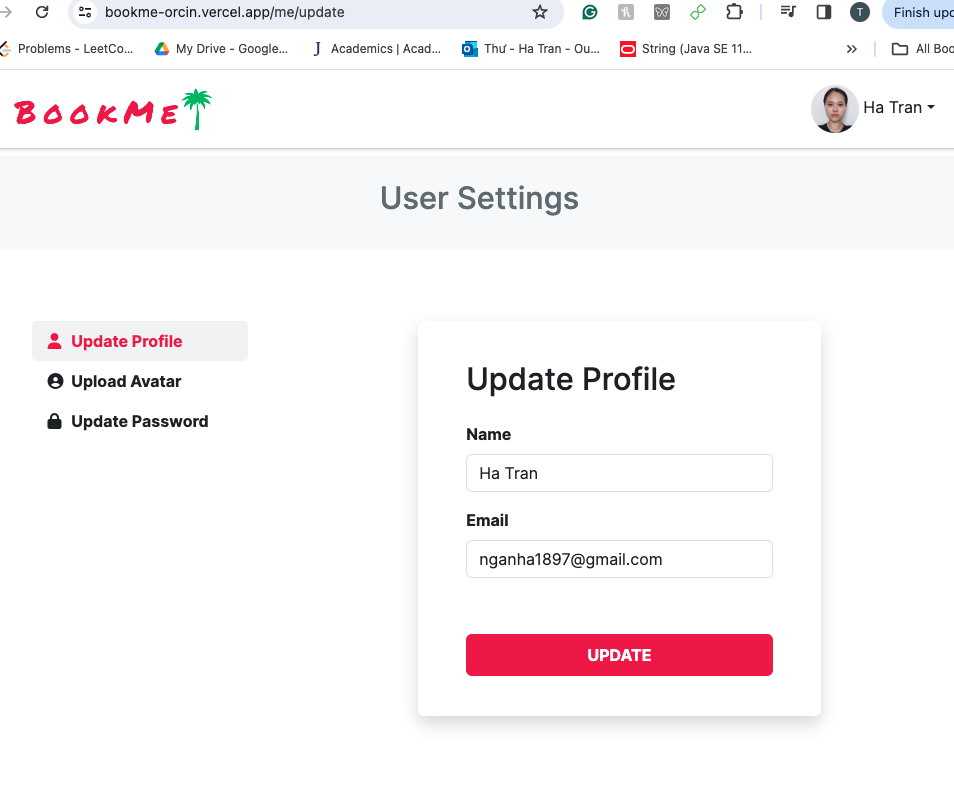

# BookMe: A room booking full-stack web application using React (Next.js)

## Project Overview
This application uses React library and Next.js framework to build a web application for renting and booking hotel rooms or homestays. MongoDB is used for data storage and Stripe is used for payment. 
The application is deployed on vercel: [https://bookme-orcin.vercel.app](https://bookme-orcin.vercel.app)

## Technologies
- React
- Next.js
- Redux for state management
- Node.js
- MongoDB for data storage
- NextAuth.js for authentication

## Features

### User Authentication
Users are required to create an account and sign in in order to book rooms. Users are not required to sign in to view rooms or check room availability. If users forget their password, an email is sent to users' email address with a link to update their password. 

### Room Listings
All rooms are displayed on the homepage for all users. Users can click on a room to view room details such as location (with map), room details and amenities, room availability displayed on a calendar, and room reviews and ratings.

### Booking Functionalities
Afer users are successfully authenticated, users can book rooms on a first-come-first-served basis. Stripe is integrated to handle user payments. 

### User Dashboard
Users can see and update their account details including name, email, avatar, password. Users can see a list of their successful bookings and download an invoice for each booking. 

### Admin Dashboard
Only admins have access to the admin dashboard, where they can view/update/delete rooms, bookings, and user information. 
Admins can view or delete room reviews. Admins also have access to sales reports.

